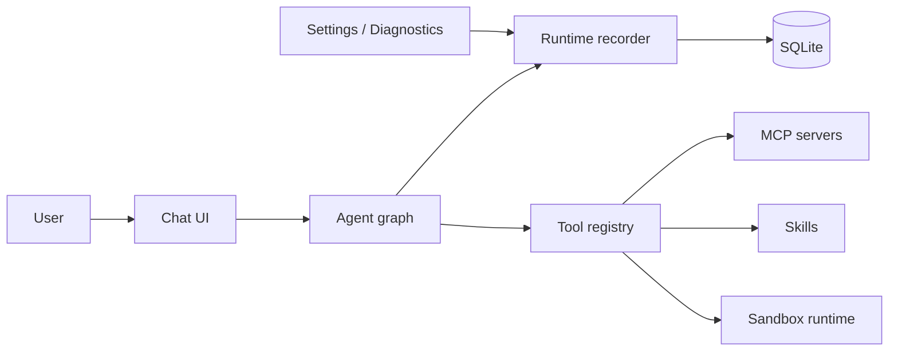

# Void AI Architecture

## Direction

Void AI is a local-first desktop AI system. The product surface is intentionally small and stable:

- `Chat`: the default entry for user work.
- `Agents`: identities, roles, instructions, persona, model choice, and policies.
- `Workflows`: reusable processes and execution summaries.
- `Tools`: built-in tools, MCP tools, Skills, sandbox tools, approval policy, and secrets.
- `Memory`: global, agent-scoped, and conversation-scoped durable context.
- `Settings`: providers, API keys, profiles, sync, and advanced Diagnostics.

Engineering support is modeled as `Runtime` and `Diagnostics`. It is not a top-level product area. The runtime records the feedback loop for model calls, tools, approvals, handoffs, sandbox work, guardrails, diagnostics, errors, and tests.

## Runtime Shape

The main product runtime entry is `runAgentChat`. Supporting modules stay narrow:

- `runtime-recorder`: creates runs, steps, and events.
- `agent-graph`: chooses the root agent and routing path.
- `tool-registry`: exposes built-in, MCP, Skill, and sandbox tools.
- `approval-policy`: decides when human review is required.
- `sandbox-runtime`: records isolated command/file/test work as runtime steps.

## Data Model

SQLite is the local source of truth.

- Core chat: `conversations`, `messages`.
- Agents: `agents`, `agent_policies`.
- Runtime: `runtime_runs`, `runtime_steps`, `runtime_events`.
- Tools: `tool_servers`, `tools`, `tool_secrets`.
- Workflows: `workflows`, `workflow_runs`.
- Memory: `memories`.
- Settings: `settings`, `model_providers`, `model_api_keys`, `interaction_profiles`, `sync_profiles`.

Messages store `content_json` and `metadata_json`. Conversations use soft delete so the trash flow can be implemented without retaining obsolete migration compatibility.

## Runtime Events

`runtime_events` is the unified diagnostic and audit stream:

- `id`
- `run_id`
- `step_id`
- `conversation_id`
- `agent_id`
- `tool_id`
- `owner_type`
- `owner_id`
- `kind`
- `status`
- `severity`
- `title`
- `detail_json`
- `duration_ms`
- `created_at`

Allowed `kind` values are `model`, `tool`, `approval`, `handoff`, `memory`, `workflow`, `sandbox`, `guardrail`, `diagnostic`, and `error`.

Allowed `status` values are `queued`, `running`, `waiting_approval`, `succeeded`, `failed`, and `cancelled`.

## IPC And Renderer API

Renderer code talks through explicit preload namespaces:

- `runtime.*`
- `tools.*`
- `agents.*`
- `memory.*`
- `conversations.*`
- `messages.*`
- `settings.*`
- `providers.*`

The renderer never receives decrypted secrets. `tool_secrets` and model keys are written and resolved in the main process.

## UI

The app opens to Chat by default. The left navigation contains only Chat, Agents, Workflows, Tools, and Memory. Diagnostics is available from Settings for advanced inspection.

Tools owns:

- MCP server configuration and discovery.
- Skill registration and execution metadata.
- Built-in tool visibility.
- Approval and auto-use indicators.
- Local secret references.

Tools is a management surface, not a read-only inventory. It supports adding, editing,
deleting, enabling, testing, and discovering MCP servers across `stdio`, `http`, and `sse`
transports. Tool records from MCP servers, built-in tools, Skills, and sandbox tools share
the same enable, auto-use, and approval switches through `tools:updateTool`.

Skills are stored as tool records with trigger keywords, tags, config schema, config JSON,
workflow steps, secrets, and run history. The Skill runtime records each manual or model-led
execution into Runtime events so diagnostics remain centralized.

Agents owns identity and policy. Workflows owns reusable process definitions. Runtime owns observed execution facts.

Agents is also a management surface. It supports create, edit, duplicate, archive, restore,
enable/disable, model override, runtime policy, routing policy, tool policy, and per-agent
runtime history. Agent routing only considers active, unlocked, enabled child agents.

Media generation is routed by capability instead of by the currently selected chat model.
Image requests require an `imageOutput` model, speech requests require `speechOutput`,
transcription requires `transcription`, and video requires `videoOutput`. The local media
endpoint returns structured error codes for unauthorized sessions, invalid requests, missing
models, unsupported models, provider permission failures, and upstream failures. Renderer UI
maps those codes to localized, actionable messages.

## Seeding

Initial seed data creates:

- A default root agent.
- A small set of built-in tools.
- Starter workflow definitions.
- Local interaction and sync profiles.
- Default settings and providers.

There is no legacy migration path. The project is not live, so development databases can be dropped and recreated from the single initial migration.

## Validation

Required checks for this architecture:

- Schema initializes from an empty database.
- Default seed is present.
- Runtime events can be inserted and listed.
- Agent routing chooses the expected agent.
- Tool registry filters built-in, MCP, Skill, and sandbox tools.
- Approval flow records waiting and resolved events.
- Sandbox steps produce runtime steps and events.
- Tools page filters data by tool kind.
- Main navigation has no deprecated engineering support menu item.
- Chat can start a runtime run.
