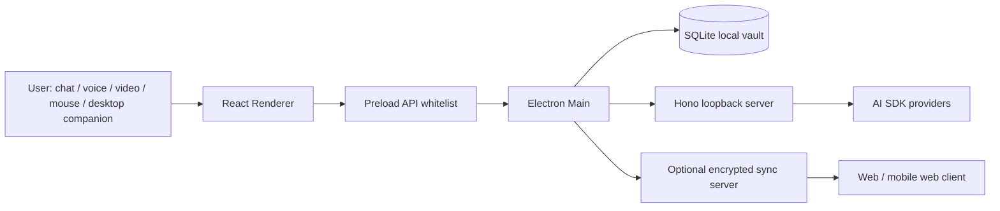

# Void AI 桌面客户端设计方案

## 目标

Void AI 是一个本地优先的 AI 桌面客户端，同时保留 Web 端演进路径。桌面端必须能在没有自部署云 Server 的情况下独立运行；云端只承担可选同步、远程访问、团队协作和跨设备备份。

首期产品形态不是单一聊天框，而是一个 AI 工作台：Agents、Workflows、Harness、Memory、Server、Interactions、Sync 都有独立数据模型、持久化入口和 UI 可见面板。

## 技术选择

当前仓库已经是 Electron + React + AI SDK + Hono + SQLite/Drizzle，因此继续沿这个方向改造。

- Electron: 负责 Windows 11、macOS、Linux 桌面客户端。Main 进程持有数据库、密钥和本地服务；Renderer 只通过 preload 白名单访问能力。
- React Renderer: 桌面优先布局，同时用响应式网格和可换行头部适配不同分辨率；后续可以抽到 Web app 复用。
- Hono loopback Server: 绑定 `127.0.0.1`，为 AI SDK streaming 提供 HTTP 接口。
- SQLite + Drizzle: 本地持久化源，启用 WAL、foreign keys、busy timeout。
- AI SDK: 统一模型 provider、流式聊天和未来工具调用/agent loop。

Tauri v2 可以作为未来轻量桌面壳备选，但当前代码已有 Electron 原生模块、preload、builder 和 better-sqlite3 链路，短期迁移成本高于收益。

## 运行架构

## 数据持久化

SQLite 是桌面端唯一事实源。新增表：

- `agents`: 智能体人格、角色、声音、模型偏好和 soul prompt。
- `memories`: 全局、智能体、会话三类记忆，带 salience 和 pinned 权重。
- `workflows`: 可组合步骤定义，支持 prompt、tool、approval、memory、handoff。
- `workflow_runs`: 工作流运行结果。
- `harness_events`: 工具、测试、审批、自动化、错误的审计记录。
- `server_nodes`: 本地 loopback、可选 sync server、MCP 等节点。
- `interaction_profiles`: chat、voice、video、mouse、desktop_pet 的开关和状态。
- `sync_state`: 设备 ID、同步模式、加密状态、冲突策略。

API Key 仍使用现有 AES-256-GCM 加密存储，不暴露明文到 renderer。

## 记忆与灵魂

“灵魂”不只是一段 prompt，而是多层上下文：

- Identity: Agent 的 name、role、description。
- Personality: 稳定语气、边界和协作风格。
- Soul prompt: 长期自我设定和关系连续性要求。
- Memory: 用户偏好、事实、互动片段、工作习惯。

当前 `/api/chat` 已支持 `agentId` 和 `conversationId`，后端会从 SQLite 读取 Agent 与相关 Memory，组装 system prompt 后再调用模型。

## Workflows 与 Harness

Workflows 描述“应如何做事”，Harness 记录“实际做了什么”。这个拆分很重要：

- Workflow 是可编辑、可复用的计划。
- WorkflowRun 是每次执行。
- HarnessEvent 是工具调用、审批、自动化、测试的审计日志。

未来工具调用、文件操作、浏览器控制、MCP 调用都应写入 Harness，便于回放、调试和安全审计。

## 多交互形态

交互分为输入、输出和 embodied presence 三层：

- Chat: 当前已可用。
- Voice: Web Speech / 系统 STT/TTS / provider realtime API 三选一，可按平台适配。
- Video: 通过用户授权采集 camera frame，交给多模态模型；默认关闭。
- Mouse: 桌面端通过明确授权捕捉选区、窗口、坐标意图；默认关闭。
- Desktop companion: Electron 透明浮窗或 always-on-top 小窗，状态来自 Agent mood、Memory 和当前工作流。

所有非文本交互都必须是显式 opt-in，并写入 Harness。

## Web 与同步

Web 端建议复用 renderer 组件，但 API adapter 不同：

- Desktop adapter: `window.api` -> Electron preload -> SQLite/Main。
- Web adapter: HTTPS -> Cloud Server -> Postgres/SQLite-compatible sync store。
- Offline Web: IndexedDB 保存短期 outbox，联网后推送。

同步策略：

- 默认 `local_only`。
- 开启同步后，客户端生成 device ID，变更写入 outbox。
- outbox 以端到端加密 payload 上传。
- Memory、Agent soul、Workflow definition 的冲突进入 review；普通更新时间可 last-write-wins。

## 当前实现状态

已完成：

- 数据表和 Drizzle 迁移。
- 默认 Agents、Memory、Workflows、Harness、Server、Interactions、Sync 种子数据。
- IPC/preload/renderer API 白名单。
- AI 服务注入 Agent + Memory system prompt。
- 左侧工作台导航。
- Dashboard、Agents、Workflows、Memory、Harness、Server、Interactions、Sync 页面。
- Chat 页 AgentSelector + ModelSelector。

下一步：

- Agent 编辑器和 Memory 编辑器。
- Workflow 可视化编辑和运行引擎。
- Harness 详情页和工具调用 schema。
- Web app adapter。
- Voice/video 权限流和桌宠透明窗口原型。
- Sync outbox、端到端加密和冲突审阅 UI。

## 参考

- Electron process model: https://www.electronjs.org/docs/latest/tutorial/process-model
- Electron context isolation: https://www.electronjs.org/docs/latest/tutorial/context-isolation
- Tauri v2 start guide: https://v2.tauri.app/start/
- AI SDK docs: https://ai-sdk.dev/docs
- SQLite WAL: https://www.sqlite.org/wal.html
